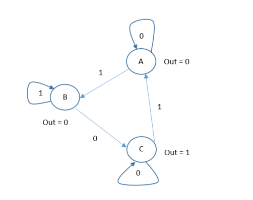
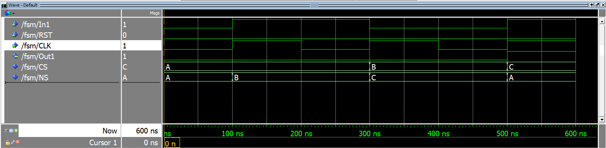
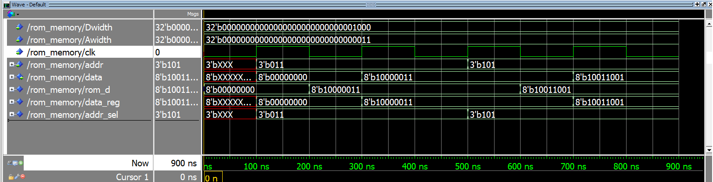

# VHDL-codes-sequential-circuits

This project contains all of the VHDL codes for sequential circuits that I have practiced.
The outputs of the codes are as follows and the codes are provided in the respective repositories.

## Two 8-bit Registers controlled by a 2:1 MUX
#### Circuit

%20with%202%20Registers%20(8-bit)/ex_24_ckt.png)
#### Output

%20with%202%20Registers%20(8-bit)/ex_24_op.png)

## Counter (8 bit)
#### Counts to the value set in Max_count
/Counter.png)

## D flip-flop
#### [using all conditional methods(wait (no reset), wait (synchronous reset) , asynchronous reset, asynchronous reset with enable)]

## Data Register (8bit)
/data_reg.png)
/data_reg_op.png)

## FIFO memory (8x9)
#### 8-deep, 9 bits wide.
/fifo.png)

## A Finite State Machine (FSM)
#### Designed according to the following diagram.

## Memory (8bit) (using D flip-flop)
/Memory_Dff.png)
/Memory_Dff2.png)

## RAM (128 by 32 single-port)
/RAM%20(128%20by%2032)%20(single-port).png)

## ROM
##### The data is obtained after one cycle from when address is called. 

## Register file
#### Register Files allow addressing of registers.
##### (only code) 

## Shift Register (4bit)
/Shift_Register.png)
/Shift_Register_op.png)
